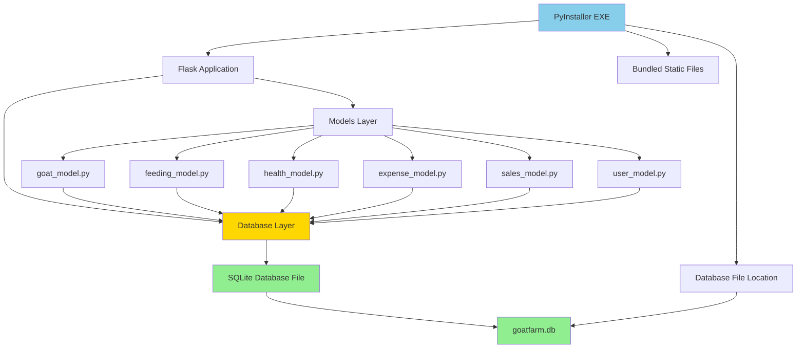
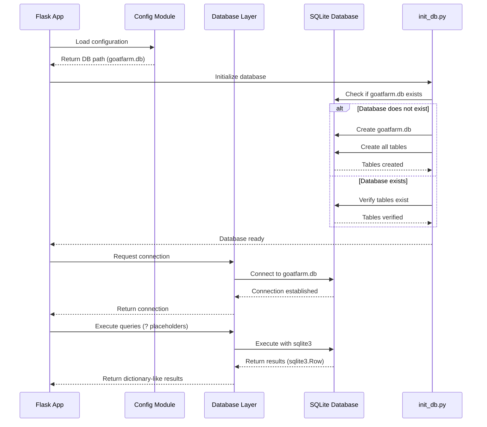

# Design Document: MySQL to SQLite Migration

## Overview

This design document outlines the migration strategy for converting a Python Flask goat farm management application from MySQL to SQLite for standalone desktop deployment. The migration enables the application to run as a self-contained PyInstaller executable with a portable, single-file database (goatfarm.db) that requires no external database installation. The migration maintains complete backward compatibility with existing data structures and API functionality while adapting database connection logic, query syntax, and schema definitions to SQLite's requirements.

The core technical changes involve replacing mysql.connector with Python's built-in sqlite3 module, converting MySQL-specific SQL syntax (AUTO_INCREMENT, BOOLEAN types, %s placeholders) to SQLite equivalents (AUTOINCREMENT, INTEGER for booleans, ? placeholders), and implementing proper database file path resolution for PyInstaller bundled executables.

## Architecture



## Main Migration Workflow



## Components and Interfaces

### Component 1: Database Connection Layer (database/db.py)

**Purpose**: Provides database connection management for the entire application, replacing MySQL connector with SQLite.

**Interface**:
```python
def get_db_connection() -> sqlite3.Connection:
    """
    Establishes and returns a SQLite database connection.
    
    Returns:
        sqlite3.Connection: Database connection with Row factory enabled
        
    Raises:
        Exception: If database connection fails
    """
    pass
```

**Responsibilities**:
- Establish SQLite connection to goatfarm.db
- Configure sqlite3.Row factory for dictionary-like access
- Handle PyInstaller executable path resolution
- Provide error handling for connection failures
- Ensure database file is created in correct location

**Key Changes from MySQL**:
- Replace `mysql.connector.connect()` with `sqlite3.connect()`
- Remove host, user, password parameters
- Add `conn.row_factory = sqlite3.Row` for dictionary access
- Use `Config.DB_PATH` instead of separate host/user/password/database configs

### Component 2: Database Initialization (models/init_db.py)

**Purpose**: Creates database file and initializes all table schemas on first run.

**Interface**:
```python
def create_database() -> None:
    """
    Creates the SQLite database file if it doesn't exist.
    No-op for SQLite (file created automatically on connect).
    """
    pass

def create_tables() -> None:
    """
    Creates all required tables with SQLite-compatible schemas.
    Uses IF NOT EXISTS to safely handle existing databases.
    """
    pass
```

**Responsibilities**:
- Create goatfarm.db file in correct location
- Define and create 6 tables (goats, feeding, health, expense, sales, users)
- Convert MySQL schema syntax to SQLite syntax
- Handle idempotent table creation (IF NOT EXISTS)
- Provide success/error feedback

**Key Schema Changes**:
- `INT AUTO_INCREMENT PRIMARY KEY` → `INTEGER PRIMARY KEY AUTOINCREMENT`
- `BOOLEAN` → `INTEGER` (0 for false, 1 for true)
- `DATETIME` → `TEXT` (ISO 8601 format: YYYY-MM-DD HH:MM:SS)
- `DATE` → `TEXT` (ISO 8601 format: YYYY-MM-DD)
- Remove `CREATE DATABASE` logic (SQLite uses file-based databases)

### Component 3: Configuration Module (config.py)

**Purpose**: Centralized configuration for database path and application settings.

**Interface**:
```python
class Config:
    DB_PATH: str  # Path to goatfarm.db
    PORT: int
    DEBUG: bool
    BASE_DIR: str
    UPLOAD_FOLDER: str
```

**Responsibilities**:
- Define database file path (goatfarm.db)
- Handle PyInstaller executable directory detection
- Provide application configuration constants
- Ensure database file is placed in writable location

**Key Changes from MySQL**:
- Replace `DB_HOST`, `DB_USER`, `DB_PASSWORD`, `DB_NAME` with single `DB_PATH`
- Add logic to detect PyInstaller frozen state
- Place database file in executable directory or user data directory

### Component 4: Model Layer (models/*.py)

**Purpose**: Data access layer providing CRUD operations for each entity.

**Interface** (example for goat_model.py):
```python
def insert_goat(values: tuple) -> None:
    """Insert new goat record"""
    pass

def fetch_all_goats() -> list[dict]:
    """Fetch all active goat records"""
    pass

def update_goat_by_id(goat_id: int, values: tuple) -> None:
    """Update goat record by ID"""
    pass

def delete_goat_by_id(goat_id: int) -> None:
    """Soft delete goat record by ID"""
    pass
```

**Responsibilities**:
- Execute parameterized queries using ? placeholders
- Convert cursor results to dictionary-like objects
- Handle connection lifecycle (open, execute, close)
- Maintain existing API contracts (no signature changes)

**Key Changes from MySQL**:
- Replace all `%s` placeholders with `?`
- Replace `cursor(dictionary=True)` with `conn.row_factory = sqlite3.Row`
- Convert Row objects to dictionaries where needed
- Handle SQLite-specific date/time functions (date('now'), datetime('now'))

## Data Models

### Model 1: Goats Table

```python
# SQLite Schema
CREATE TABLE IF NOT EXISTS goats (
    id INTEGER PRIMARY KEY AUTOINCREMENT,
    goat_code TEXT UNIQUE,
    name TEXT,
    breed TEXT,
    age INTEGER,
    weight REAL,
    gender TEXT,
    status TEXT,
    photo_url TEXT,
    created_on TEXT,
    updated_on TEXT,
    is_active INTEGER DEFAULT 1
)
```

**Validation Rules**:
- `goat_code` must be unique across all records
- `age` must be non-negative integer
- `weight` must be positive float
- `gender` must be one of: 'Male', 'Female'
- `status` must be one of: 'Active', 'Sold', 'Deceased'
- `is_active` must be 0 or 1

### Model 2: Feeding Table

```python
# SQLite Schema
CREATE TABLE IF NOT EXISTS feeding (
    id INTEGER PRIMARY KEY AUTOINCREMENT,
    goat_id INTEGER,
    food_type TEXT,
    quantity REAL,
    feeding_date TEXT,
    notes TEXT,
    created_on TEXT,
    updated_on TEXT,
    is_active INTEGER DEFAULT 1
)
```

**Validation Rules**:
- `goat_id` must reference valid goat record
- `quantity` must be positive float
- `feeding_date` must be valid ISO 8601 date (YYYY-MM-DD)
- `is_active` must be 0 or 1

### Model 3: Health Table

```python
# SQLite Schema
CREATE TABLE IF NOT EXISTS health (
    id INTEGER PRIMARY KEY AUTOINCREMENT,
    goat_id INTEGER,
    issue TEXT,
    medicine TEXT,
    vaccination_date TEXT,
    next_due_date TEXT,
    notes TEXT,
    created_on TEXT,
    updated_on TEXT,
    is_active INTEGER DEFAULT 1
)
```

**Validation Rules**:
- `goat_id` must reference valid goat record
- `vaccination_date` must be valid ISO 8601 date
- `next_due_date` must be valid ISO 8601 date
- `next_due_date` must be >= `vaccination_date`
- `is_active` must be 0 or 1

### Model 4: Expense Table

```python
# SQLite Schema
CREATE TABLE IF NOT EXISTS expense (
    id INTEGER PRIMARY KEY AUTOINCREMENT,
    expense_type TEXT,
    amount REAL,
    date TEXT,
    notes TEXT,
    created_on TEXT,
    updated_on TEXT,
    is_active INTEGER DEFAULT 1
)
```

**Validation Rules**:
- `amount` must be positive float
- `date` must be valid ISO 8601 date
- `is_active` must be 0 or 1

### Model 5: Sales Table

```python
# SQLite Schema
CREATE TABLE IF NOT EXISTS sales (
    id INTEGER PRIMARY KEY AUTOINCREMENT,
    goat_id INTEGER,
    price REAL,
    buyer_name TEXT,
    date TEXT,
    notes TEXT,
    created_on TEXT,
    updated_on TEXT,
    is_active INTEGER DEFAULT 1
)
```

**Validation Rules**:
- `goat_id` must reference valid goat record
- `price` must be positive float
- `date` must be valid ISO 8601 date
- `is_active` must be 0 or 1

### Model 6: Users Table

```python
# SQLite Schema
CREATE TABLE IF NOT EXISTS users (
    id INTEGER PRIMARY KEY AUTOINCREMENT,
    username TEXT,
    password TEXT,
    created_on TEXT,
    updated_on TEXT,
    is_active INTEGER DEFAULT 1
)
```

**Validation Rules**:
- `username` must be unique and non-empty
- `password` must be non-empty (should be hashed in production)
- `is_active` must be 0 or 1

## Algorithmic Pseudocode

### Main Database Connection Algorithm

```pascal
ALGORITHM get_db_connection()
OUTPUT: connection of type sqlite3.Connection

BEGIN
  TRY
    // Step 1: Determine database file path
    db_path ← Config.DB_PATH
    
    // Step 2: Ensure parent directory exists
    parent_dir ← get_parent_directory(db_path)
    IF NOT exists(parent_dir) THEN
      create_directory(parent_dir)
    END IF
    
    // Step 3: Establish SQLite connection
    connection ← sqlite3.connect(db_path)
    
    // Step 4: Configure Row factory for dictionary-like access
    connection.row_factory ← sqlite3.Row
    
    // Step 5: Enable foreign key constraints (optional but recommended)
    cursor ← connection.cursor()
    cursor.execute("PRAGMA foreign_keys = ON")
    cursor.close()
    
    RETURN connection
    
  CATCH exception AS e
    PRINT "DB Connection Error:", e
    RETURN None
  END TRY
END
```

**Preconditions**:
- Config.DB_PATH is defined and points to valid file path
- sqlite3 module is available (built-in to Python)
- File system has write permissions for database location

**Postconditions**:
- Returns valid sqlite3.Connection object with Row factory configured
- Database file is created if it doesn't exist
- Returns None if connection fails
- Foreign key constraints are enabled

**Loop Invariants**: N/A (no loops in this function)

### Database Initialization Algorithm

```pascal
ALGORITHM create_tables()
OUTPUT: None (side effect: creates tables in database)

BEGIN
  // Step 1: Establish database connection
  connection ← sqlite3.connect(Config.DB_PATH)
  cursor ← connection.cursor()
  
  // Step 2: Define table schemas
  table_schemas ← [
    goats_schema,
    feeding_schema,
    health_schema,
    expense_schema,
    sales_schema,
    users_schema
  ]
  
  // Step 3: Create each table with loop invariant
  FOR each schema IN table_schemas DO
    ASSERT connection.is_open() = true
    
    TRY
      cursor.execute(schema)
      PRINT "✅ Table created:", extract_table_name(schema)
    CATCH exception AS e
      PRINT "❌ Table creation failed:", e
      ROLLBACK connection
      RAISE exception
    END TRY
  END FOR
  
  // Step 4: Commit all changes
  connection.commit()
  
  // Step 5: Clean up
  cursor.close()
  connection.close()
  
  PRINT "✅ All tables created successfully"
END
```

**Preconditions**:
- Config.DB_PATH is defined
- Database file location is writable
- All table schemas are valid SQLite DDL

**Postconditions**:
- All 6 tables exist in database
- Tables use IF NOT EXISTS (idempotent operation)
- Connection is properly closed
- Success message is printed

**Loop Invariants**:
- Connection remains open throughout iteration
- All previously created tables remain valid
- Transaction is not committed until all tables are created

### Query Execution with Placeholder Conversion Algorithm

```pascal
ALGORITHM execute_parameterized_query(query, parameters)
INPUT: query of type String, parameters of type Tuple
OUTPUT: result of type List[Dict] or None

BEGIN
  // Step 1: Establish connection
  connection ← get_db_connection()
  IF connection = None THEN
    RETURN None
  END IF
  
  // Step 2: Create cursor
  cursor ← connection.cursor()
  
  // Step 3: Execute query with ? placeholders
  TRY
    cursor.execute(query, parameters)
    
    // Step 4: Handle SELECT vs INSERT/UPDATE/DELETE
    IF query starts with "SELECT" THEN
      // Fetch results and convert Row objects to dictionaries
      rows ← cursor.fetchall()
      result ← []
      
      FOR each row IN rows DO
        dict_row ← convert_row_to_dict(row)
        result.append(dict_row)
      END FOR
      
      cursor.close()
      connection.close()
      RETURN result
      
    ELSE
      // INSERT/UPDATE/DELETE - commit changes
      connection.commit()
      cursor.close()
      connection.close()
      RETURN None
    END IF
    
  CATCH exception AS e
    PRINT "Query execution error:", e
    connection.rollback()
    cursor.close()
    connection.close()
    RAISE exception
  END TRY
END
```

**Preconditions**:
- query is valid SQLite SQL with ? placeholders
- parameters tuple length matches number of ? placeholders
- Database connection is available

**Postconditions**:
- For SELECT: Returns list of dictionaries representing rows
- For INSERT/UPDATE/DELETE: Changes are committed to database
- Connection and cursor are properly closed
- On error: Transaction is rolled back, exception is raised

**Loop Invariants**:
- All processed rows are valid dictionary representations
- Connection remains open until all rows are processed

## Key Functions with Formal Specifications

### Function 1: get_db_connection()

```python
def get_db_connection() -> sqlite3.Connection | None:
    """
    Establishes connection to SQLite database with Row factory.
    
    Returns:
        sqlite3.Connection with row_factory set to sqlite3.Row, or None on error
    """
    pass
```

**Preconditions**:
- Config.DB_PATH is defined and accessible
- Parent directory of DB_PATH exists or is creatable
- Process has write permissions to database location

**Postconditions**:
- Returns sqlite3.Connection object with row_factory = sqlite3.Row
- Database file exists at Config.DB_PATH
- Foreign key constraints are enabled
- Returns None if connection fails (error logged)
- No side effects on input parameters (no parameters)

**Loop Invariants**: N/A

### Function 2: insert_goat(values)

```python
def insert_goat(values: tuple) -> None:
    """
    Inserts new goat record into database.
    
    Args:
        values: Tuple of (goat_code, name, breed, age, weight, gender, 
                status, photo_url, created_on, updated_on, is_active)
    """
    pass
```

**Preconditions**:
- values is tuple with exactly 11 elements
- values[0] (goat_code) is unique in database
- values[3] (age) is non-negative integer
- values[4] (weight) is positive float
- values[10] (is_active) is 0 or 1
- Database connection is available

**Postconditions**:
- New row inserted into goats table
- Auto-generated ID is assigned
- Changes are committed to database
- Connection is closed
- On error: Transaction rolled back, exception raised

**Loop Invariants**: N/A

### Function 3: fetch_all_goats()

```python
def fetch_all_goats() -> list[dict]:
    """
    Fetches all active goat records from database.
    
    Returns:
        List of dictionaries, each representing a goat record
    """
    pass
```

**Preconditions**:
- Database connection is available
- goats table exists

**Postconditions**:
- Returns list of dictionaries (may be empty)
- Each dictionary contains all goat table columns
- Only records with is_active=1 are returned
- Connection is closed after fetch
- No mutations to database

**Loop Invariants**:
- All processed rows have is_active=1
- All rows are valid dictionary representations

### Function 4: update_goat_by_id(goat_id, values)

```python
def update_goat_by_id(goat_id: int, values: tuple) -> None:
    """
    Updates existing goat record.
    
    Args:
        goat_id: Primary key of goat to update
        values: Tuple of (name, breed, age, weight, gender, status, updated_on)
    """
    pass
```

**Preconditions**:
- goat_id exists in goats table
- goat with goat_id has is_active=1
- values is tuple with exactly 7 elements
- values[2] (age) is non-negative integer
- values[3] (weight) is positive float
- Database connection is available

**Postconditions**:
- Goat record with id=goat_id is updated
- Only specified fields are modified
- updated_on timestamp is set to current time
- Changes are committed to database
- Connection is closed
- If goat_id not found or is_active=0: No changes made

**Loop Invariants**: N/A

### Function 5: fetch_vaccination_due()

```python
def fetch_vaccination_due() -> list[dict]:
    """
    Fetches health records with vaccinations due today or earlier.
    
    Returns:
        List of dictionaries representing overdue vaccination records
    """
    pass
```

**Preconditions**:
- Database connection is available
- health table exists
- next_due_date column contains valid ISO 8601 dates

**Postconditions**:
- Returns list of dictionaries (may be empty)
- Each record has next_due_date <= current date
- Only records with is_active=1 are returned
- Connection is closed after fetch
- No mutations to database

**Loop Invariants**:
- All processed rows have next_due_date <= current date
- All processed rows have is_active=1

## Example Usage

### Example 1: Database Connection

```python
# Establish connection
conn = get_db_connection()

if conn:
    cursor = conn.cursor()
    cursor.execute("SELECT * FROM goats WHERE is_active=?", (1,))
    goats = cursor.fetchall()
    
    # Access row data (dictionary-like)
    for goat in goats:
        print(goat['name'], goat['breed'])
    
    cursor.close()
    conn.close()
else:
    print("Failed to connect to database")
```

### Example 2: Insert Operation

```python
from datetime import datetime

# Prepare values
values = (
    'G001',                    # goat_code
    'Billy',                   # name
    'Boer',                    # breed
    3,                         # age
    45.5,                      # weight
    'Male',                    # gender
    'Active',                  # status
    '/static/uploads/G001.jpg', # photo_url
    datetime.now().isoformat(), # created_on
    datetime.now().isoformat(), # updated_on
    1                          # is_active
)

# Insert goat
insert_goat(values)
```

### Example 3: Query with Date Comparison (SQLite-specific)

```python
# Fetch overdue vaccinations
conn = get_db_connection()
cursor = conn.cursor()

# SQLite date comparison using date() function
cursor.execute("""
    SELECT * FROM health
    WHERE next_due_date <= date('now') AND is_active=?
""", (1,))

overdue = cursor.fetchall()

for record in overdue:
    print(f"Goat {record['goat_id']}: {record['issue']} due on {record['next_due_date']}")

cursor.close()
conn.close()
```

### Example 4: Complete Workflow (Initialize + Query)

```python
from models.init_db import create_tables
from models.goat_model import insert_goat, fetch_all_goats

# Step 1: Initialize database (first run)
create_tables()

# Step 2: Insert sample data
sample_goat = (
    'G002', 'Nanny', 'Alpine', 2, 38.0, 'Female', 
    'Active', None, datetime.now().isoformat(), 
    datetime.now().isoformat(), 1
)
insert_goat(sample_goat)

# Step 3: Fetch and display
goats = fetch_all_goats()
for goat in goats:
    print(f"{goat['goat_code']}: {goat['name']} ({goat['breed']})")
```

## Correctness Properties

### Universal Quantification Statements

1. **Connection Consistency**: ∀ connection ∈ get_db_connection() → (connection ≠ None ⟹ connection.row_factory = sqlite3.Row)

2. **Placeholder Correctness**: ∀ query ∈ SQL_queries → (count('?', query) = len(parameters))

3. **Boolean Mapping**: ∀ boolean_field ∈ {is_active} → (boolean_field ∈ {0, 1})

4. **Primary Key Uniqueness**: ∀ table ∈ {goats, feeding, health, expense, sales, users} → (∀ row1, row2 ∈ table → (row1.id = row2.id ⟹ row1 = row2))

5. **Soft Delete Integrity**: ∀ delete_operation → (∃ row ∈ table → row.is_active = 0 ∧ row still exists in table)

6. **Date Format Consistency**: ∀ date_field ∈ {created_on, updated_on, date, feeding_date, vaccination_date, next_due_date} → (date_field matches ISO 8601 format)

7. **Connection Lifecycle**: ∀ database_operation → (connection opened ⟹ connection eventually closed)

8. **Transaction Atomicity**: ∀ write_operation → (operation succeeds ⟹ changes committed) ∧ (operation fails ⟹ changes rolled back)

9. **Row Factory Consistency**: ∀ SELECT_query → (∀ row ∈ results → row is dictionary-like object)

10. **Schema Idempotency**: ∀ create_tables() call → (tables exist after call ∧ existing data preserved)

## Error Handling

### Error Scenario 1: Database File Not Writable

**Condition**: Process lacks write permissions to database file location
**Response**: 
- get_db_connection() catches PermissionError
- Logs error message with file path
- Returns None
**Recovery**: 
- Application should check for None return value
- Display user-friendly error message
- Suggest running with appropriate permissions or changing DB_PATH

### Error Scenario 2: Corrupted Database File

**Condition**: goatfarm.db file exists but is corrupted or not a valid SQLite database
**Response**:
- sqlite3.connect() raises sqlite3.DatabaseError
- Error is caught and logged
- Returns None
**Recovery**:
- Backup corrupted file (rename to goatfarm.db.backup)
- Delete corrupted file
- Restart application to create fresh database
- User must re-enter data or restore from backup

### Error Scenario 3: Query Placeholder Mismatch

**Condition**: Number of ? placeholders doesn't match number of parameters
**Response**:
- cursor.execute() raises sqlite3.ProgrammingError
- Error is caught and logged with query details
- Transaction is rolled back
**Recovery**:
- Fix query or parameters in code
- This is a developer error, not runtime error
- Should be caught during testing

### Error Scenario 4: Foreign Key Constraint Violation

**Condition**: Attempting to insert feeding/health/sales record with non-existent goat_id
**Response**:
- cursor.execute() raises sqlite3.IntegrityError
- Error is caught and logged
- Transaction is rolled back
**Recovery**:
- Validate goat_id exists before insert
- Display error message to user
- Prompt user to select valid goat

### Error Scenario 5: Unique Constraint Violation

**Condition**: Attempting to insert goat with duplicate goat_code
**Response**:
- cursor.execute() raises sqlite3.IntegrityError
- Error is caught and logged
- Transaction is rolled back
**Recovery**:
- Check for existing goat_code before insert
- Display error message to user
- Prompt user to choose different goat_code

### Error Scenario 6: PyInstaller Path Resolution Failure

**Condition**: sys._MEIPASS not available in frozen executable
**Response**:
- Fallback to os.path.dirname(__file__)
- Log warning about path resolution
**Recovery**:
- Use current working directory as fallback
- Ensure database file is created in accessible location
- Test thoroughly in PyInstaller environment

## Testing Strategy

### Unit Testing Approach

**Test Framework**: pytest

**Key Test Cases**:

1. **Database Connection Tests**
   - Test successful connection establishment
   - Test connection with Row factory configured
   - Test connection failure handling
   - Test database file creation on first connect

2. **Schema Creation Tests**
   - Test all 6 tables are created
   - Test IF NOT EXISTS idempotency
   - Test schema syntax is valid SQLite
   - Test AUTOINCREMENT works correctly

3. **CRUD Operation Tests** (for each model):
   - Test insert with valid data
   - Test insert with invalid data (constraint violations)
   - Test fetch returns correct data structure
   - Test update modifies correct record
   - Test soft delete sets is_active=0

4. **Placeholder Conversion Tests**:
   - Test ? placeholders work correctly
   - Test parameter binding prevents SQL injection
   - Test queries with multiple placeholders

5. **Date/Time Handling Tests**:
   - Test ISO 8601 date format storage
   - Test date comparison queries (date('now'))
   - Test datetime retrieval and parsing

6. **Boolean Field Tests**:
   - Test is_active=1 for active records
   - Test is_active=0 for deleted records
   - Test queries filter by is_active correctly

**Coverage Goals**: 90%+ code coverage for database layer and models

### Property-Based Testing Approach

**Property Test Library**: Hypothesis (Python)

**Properties to Test**:

1. **Connection Idempotency**: Multiple calls to get_db_connection() should all succeed
2. **Insert-Fetch Roundtrip**: ∀ valid_data → (insert(data) ⟹ fetch() contains data)
3. **Update Preserves ID**: ∀ update_operation → (original_id = updated_id)
4. **Soft Delete Preserves Data**: ∀ delete_operation → (record still exists with is_active=0)
5. **Placeholder Count Invariant**: ∀ query → (count('?') = len(parameters))
6. **Row Factory Consistency**: ∀ SELECT_result → (all rows are dictionary-like)

**Hypothesis Strategies**:
- Generate random valid goat data (names, breeds, ages, weights)
- Generate random dates within valid ranges
- Generate random query parameter combinations
- Test with edge cases (empty strings, zero values, None values)

### Integration Testing Approach

**Test Scenarios**:

1. **End-to-End Workflow Test**:
   - Initialize database
   - Insert records across all tables
   - Perform queries with joins (if applicable)
   - Update records
   - Soft delete records
   - Verify data integrity

2. **PyInstaller Executable Test**:
   - Build executable with PyInstaller
   - Run executable in clean environment
   - Verify database file is created in correct location
   - Verify all CRUD operations work
   - Verify static files are accessible

3. **Migration Test** (if migrating existing data):
   - Export data from MySQL
   - Transform data to SQLite format
   - Import data into SQLite
   - Verify data integrity and completeness
   - Verify all queries return same results

4. **Concurrent Access Test**:
   - Simulate multiple simultaneous database operations
   - Verify no database locks or corruption
   - Verify transaction isolation

## Performance Considerations

### Database File Size
- SQLite database file grows with data
- Estimate: ~1KB per goat record, ~500 bytes per feeding/health/expense/sales record
- For 1000 goats with 10 records each: ~15MB database file
- Acceptable for desktop application

### Query Performance
- SQLite performs well for small to medium datasets (<100K rows)
- No indexes defined in current schema (add if performance issues arise)
- Consider adding indexes on:
  - goats.goat_code (already unique, automatically indexed)
  - feeding.goat_id, health.goat_id, sales.goat_id (foreign keys)
  - health.next_due_date (for vaccination due queries)

### Connection Pooling
- Current implementation opens/closes connection per operation
- Acceptable for desktop application with single user
- If performance issues arise, consider connection pooling or persistent connection

### Write-Ahead Logging (WAL)
- SQLite WAL mode improves concurrent read/write performance
- Enable with: `PRAGMA journal_mode=WAL`
- Consider enabling if application experiences database locks

## Security Considerations

### SQL Injection Prevention
- All queries use parameterized statements with ? placeholders
- Never concatenate user input into SQL strings
- sqlite3 module automatically escapes parameters

### Password Storage
- Current implementation stores passwords in plain text (users table)
- **CRITICAL**: Implement password hashing before production
- Recommended: Use bcrypt or argon2 for password hashing
- Update user_model.py to hash passwords on insert/update

### Database File Access
- Database file is readable by anyone with file system access
- Consider encrypting sensitive data at application level
- Or use SQLite encryption extensions (SQLCipher) for full database encryption

### File Path Validation
- Validate Config.DB_PATH to prevent path traversal attacks
- Ensure database file is created in expected location
- Reject paths containing ".." or absolute paths from user input

### Upload Directory Security
- Validate uploaded file types (photo_url field)
- Sanitize file names to prevent directory traversal
- Limit file sizes to prevent disk space exhaustion

## Dependencies

### Core Dependencies
- **Python 3.8+**: Required for type hints and modern syntax
- **sqlite3**: Built-in Python module (no installation required)
- **Flask**: Web framework (already in requirements.txt)
- **flask-cors**: CORS support (already in requirements.txt)

### Development Dependencies
- **PyInstaller**: For creating standalone executable
- **pytest**: Unit testing framework
- **hypothesis**: Property-based testing library

### Removed Dependencies
- **mysql-connector-python**: No longer needed after migration

### Updated requirements.txt
```
Flask==2.3.0
flask-cors==4.0.0
PyInstaller==5.13.0
pytest==7.4.0
hypothesis==6.82.0
```

### System Requirements
- **Operating System**: Windows, macOS, or Linux
- **Python Version**: 3.8 or higher
- **Disk Space**: Minimum 50MB for application + database
- **RAM**: Minimum 256MB (typical usage <100MB)
- **Permissions**: Write access to application directory for database file
